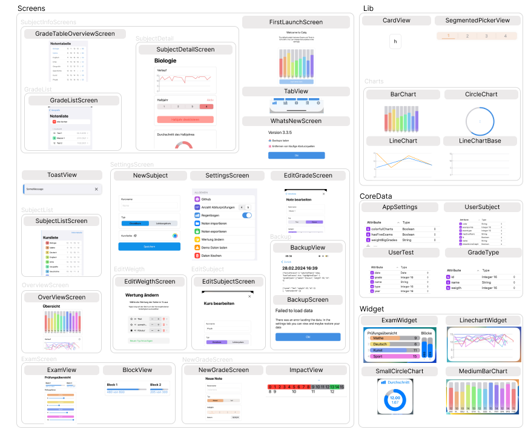

[](https://apps.apple.com/tt/app/calq-abiturnoten/id1605925893?uo=2)
[](https://apps.apple.com/tt/app/calq-abiturnoten/id1605925893?uo=2)
[](https://apps.apple.com/tt/app/calq-abiturnoten/id1605925893?uo=2)
[](https://apps.apple.com/tt/app/calq-abiturnoten/id1605925893?uo=2)

# Calq-iOS

Abiturnoten Rechner für iOS 15 oder höher.

## Funktionen

- Abiturschnitt berechnen
- Fächerdurchschnitt berechnen
- Daten als JSON exportieren und importieren
- (optional) Automatische Fächerfarben
- Berechnung Auswirkung neuer Note
- Deaktivieren von Halbjahren
- mehrere Notentypen mit variabler Gewichtung
- Sprachen: 🇩🇪 🇺🇸

[](https://apps.apple.com/tt/app/calq-abiturnoten/id1605925893?uo=2)
<br>

## Showcase

<details closed>
<summary>Showcase App (Light Mode)</summary>
<br>


</details>

<details closed>
<summary>Showcase Widget</summary>
<br>


  
</details
<br>

## Contributors

<a href = "https://github.com/AKORA-Studios/Calq/graphs/contributors">
  
</a>

## How to Install and Run the Project

```
git clone https://github.com/AKORA-Studios/Calq
```

- Open the workspace file in Xcode
- Use **CMD + R** to run the app sheme named "Calq"

## Requirements

- iOS 15.0+
- Xcode Xcode 12.1

## How to contribute

If you encounter any issues or have improvment suggestions open a ticket

Or if you want to change smth yourself or have any suggestions how to solve an open issue, fork the repository (`stable` branch pls), create a new branch describing your change/issue, then create a mergerequest explaining what you changed. Pls name your commits somewhere usefull. If you have a lot of commits pls squash them for the pr.

Note: This project uses [SwiftLint](https://github.com/realm/SwiftLint) to ensure a readble code style.

### Project Structure

- native SwiftUI, no other dependencies needed uwu
- There are no other dependencies included in this project (so no cocoapods or swift packages)
- Every View/Screen ideally should have its own viewmodel ([Reference Link](https://en.wikipedia.org/wiki/Model%E2%80%93view%E2%80%93viewmodel))
- Every Screen Class (like Settings for example) with its Viewmodels and Subscreens should have its own Folder
  - Reusable Views should have their own file in `/lib`, exmaple: Charts
  - Screens should be in /Screens, Tests in Tests etc.
- To save data the project uses CoreData and UserDefaults for more unimportant things like for exmaple the last AppVersion
  - Changes to the CoreData Model: bump the model version and if needed create a mapping Model [here is a good example how to do that](https://medium.com/@maddy.lucky4u/swift-4-core-data-part-5-core-data-migration-3fc32483a5f2)

Heres a brief overview of all screens and important things in the app, since the naming is sometimes kinda confusing for gradeList for example.


#### Data Structure

Idk if you are really really interested heres an ER-Model of the CoreData stuff


## Feature Requests

[Future features](https://github.com/AKORA-Studios/Calq/projects2) sind in dem Reiter Projekte aufgelistet. Du hast einen weiteren Verbesserungsvorschlag? [Hier](https://github.com/AKORA-Studios/Calq/issues) kannst du eines vorschlagen.
Alternativ schreib einfach eine Nachricht aufm Discord ;3

# License

Calq is available under the MIT license. See the [LICENSE](https://github.com/AKORA-Studios/Calq-iOS/blob/stable/LICENSE) file for more info.
